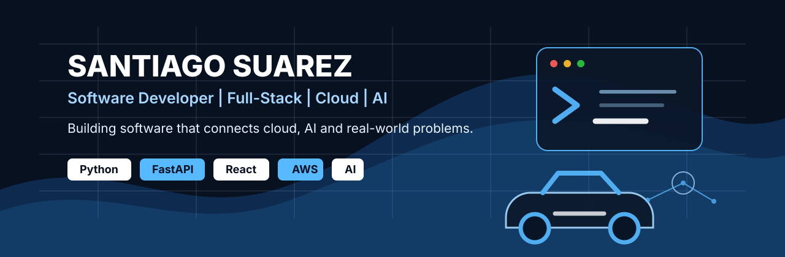

  

<h1 align="center">Santiago Suarez</h1>

  <strong>Software Developer | Full-Stack | Cloud | AI</strong> 
  Medellin, Colombia | Building software that connects cloud, AI and real-world problems.

  
  
  
  

---

## About Me

Soy desarrollador de software enfocado en construir soluciones Full-Stack, Cloud y AI con impacto en problemas reales. Me gusta conectar arquitectura, automatizacion y experiencia de usuario para crear productos utiles, mantenibles y bien pensados.

Actualmente trabajo con Python, FastAPI, React, AWS y herramientas de inteligencia artificial, combinando fundamentos tecnicos con proyectos practicos en cloud, ciberseguridad, blockchain y diagnostico automotriz.

---

## Tech Stack

<table>
  <tr>
    <td><strong>Frontend</strong></td>
    <td>
      
      
      
      
      
    </td>
  </tr>
  <tr>
    <td><strong>Backend</strong></td>
    <td>
      
      
      
      
      
    </td>
  </tr>
  <tr>
    <td><strong>Cloud & DevOps</strong></td>
    <td>
      
      
      
      
    </td>
  </tr>
  <tr>
    <td><strong>AI / Data</strong></td>
    <td>
      
      
      
      
    </td>
  </tr>
  <tr>
    <td><strong>Blockchain & Tools</strong></td>
    <td>
      
      
      
      
    </td>
  </tr>
</table>

---

## Featured Projects

<table>
  <tr>
    <td width="50%">
      <h3>ElectroVault / AWS MotoChain</h3>
      
Cloud and Web3 project focused on secure asset workflows, blockchain traceability and AWS-based architecture.

      

        
        
        
      

    </td>
    <td width="50%">
      <h3>CyberQA Agent</h3>
      
AI-assisted cybersecurity QA agent for analyzing technical scenarios, improving review workflows and supporting secure development.

      

        
        
        
      

    </td>
  </tr>
  <tr>
    <td colspan="2">
      <h3>Automotive AI Diagnostics</h3>
      
AI-based automotive diagnostic concept using oscilloscope signals, neural networks and data analysis to support fault detection in real vehicle systems.

      

        
        
        
        
      

    </td>
  </tr>
</table>

---

## Cloud & AWS

  

- AWS fundamentals: IAM, EC2, S3, Lambda, API Gateway and serverless patterns.
- Cloud project practice with deployment, automation and architecture documentation.
- Interest in secure, scalable systems that connect backend services with real-world products.

---

## GitHub Activity

  
  

---

## Currently Learning / Building

- Advanced backend architecture with Python, FastAPI and cloud-native APIs.
- AWS serverless services and deployment workflows.
- AI applied to cybersecurity, diagnostics and automation.
- Cleaner portfolio projects with strong README documentation and practical demos.

---

## Let's Connect

  <a href="mailto:santiagossuarez9@gmail.com">santiagossuarez9@gmail.com</a> |
  <a href="https://www.linkedin.com/in/santiago-suarez/">LinkedIn</a> |
  <a href="https://github.com/santy8151">GitHub</a>

